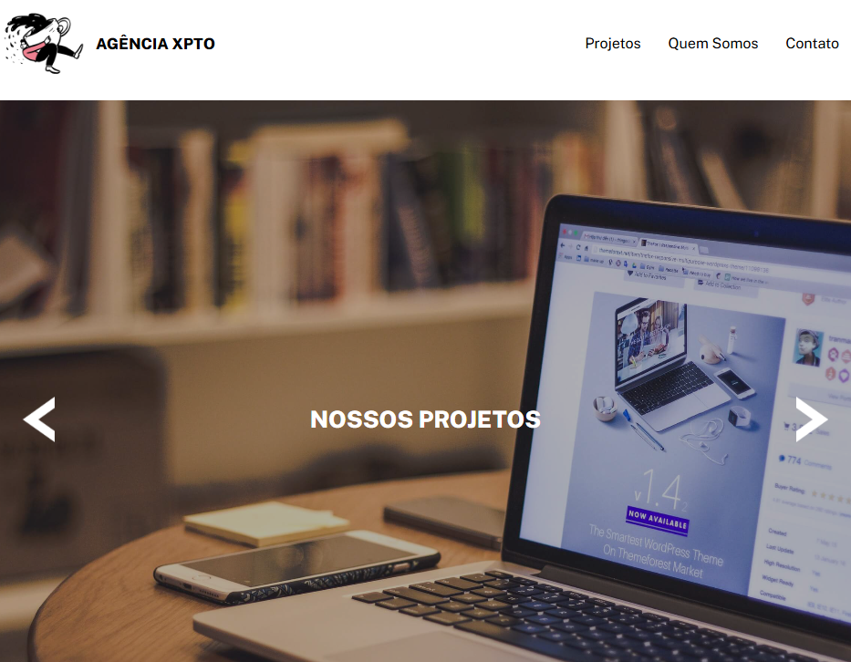

<h1 align="center">
  💻 Agência XPTO
</h1>

  

<h4 align="center"><a href="https://receita-waffle-classico.vercel.app/" target="_blank">Clique para visitar o projeto</a></h4>

## 📚 Sobre o projeto

Projeto realizado no evento <strong>Mapa Dev Week</strong> pelo canal <strong>Dev em Dobro.</strong> A intenção do evento foi disponibilizar um mapa para devs iniciantes, dando um passo a passo do que é necessário aprender para conquistar a primeira vaga como front-end em até 7 meses. Mesmo já tendo a base, esse evento foi muito útil, pois vai me ajudar a dar meus próximos passos nas tecnologias Front-end. 🚀

Durante o evento foi desenvolvido uma simples projeto de uma landing page.

## 🛠️ Tecnologias utilizadas

• HTML 
• CSS 
• JavaScript 
